# 露天矿区扰动检测平台 - 技术图表集

> 本文档包含系统的各类技术图表，使用 Mermaid 格式编写
> 可在支持 Mermaid 的编辑器（如 Typora、VS Code + 插件、GitHub）中渲染

---

## 1. 数据库 ER 图

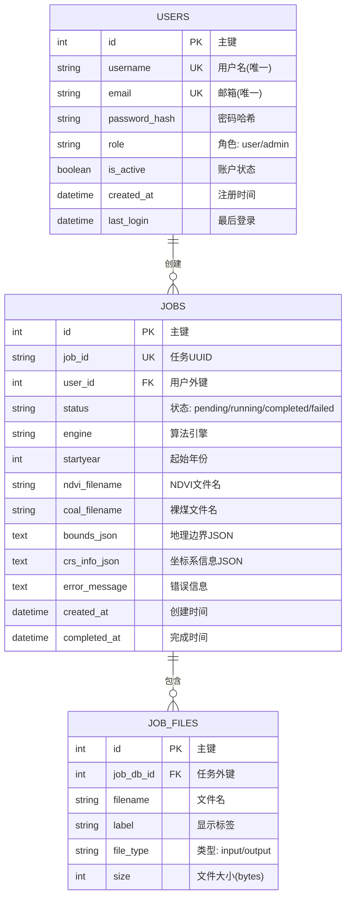

---

## 2. 系统架构图

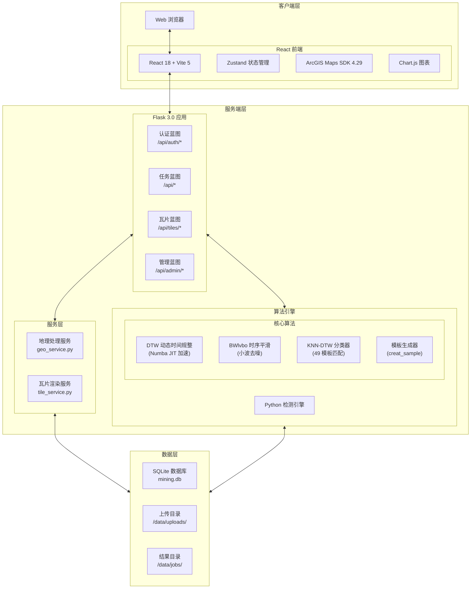

---

## 3. 用户认证时序图

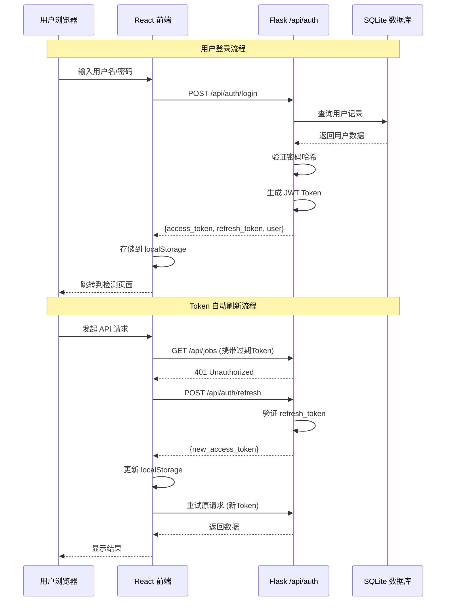

---

## 4. 检测任务处理时序图

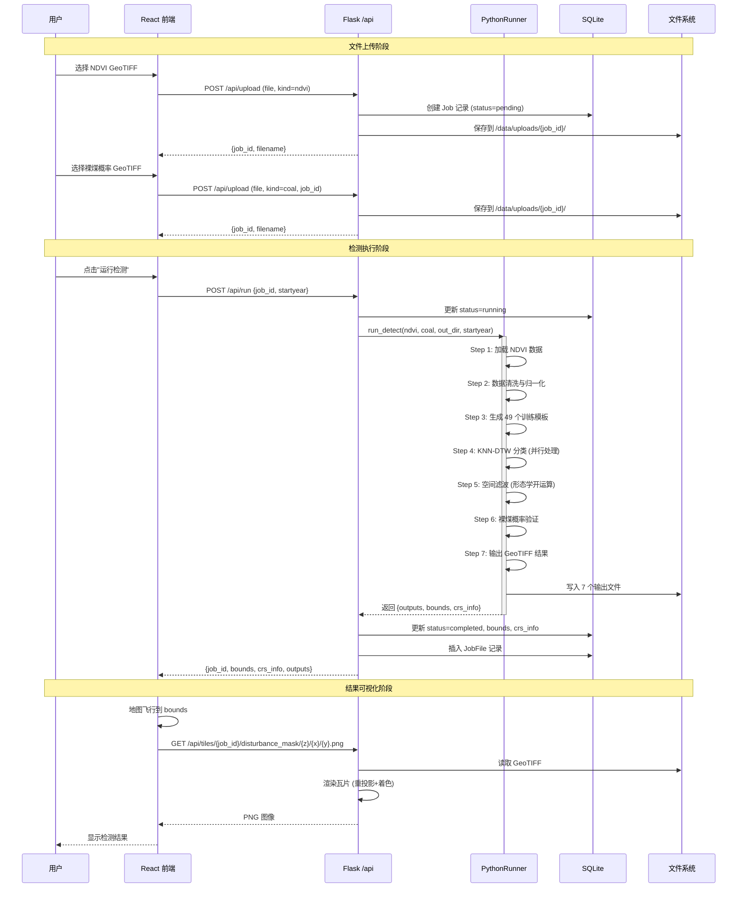

---

## 5. KNN-DTW 算法流程图

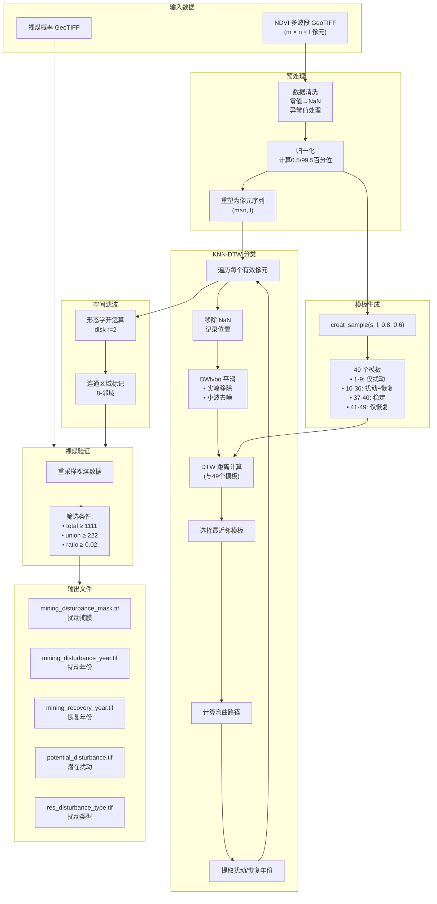

---

## 6. DTW 动态时间规整原理图

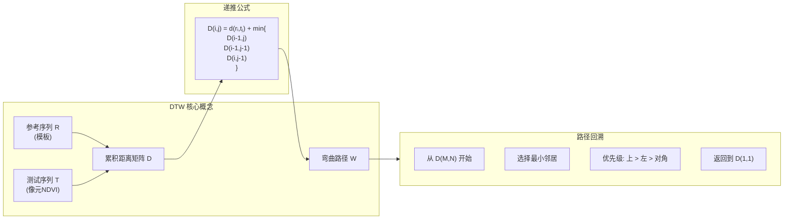

---

## 7. 49 模板分类图

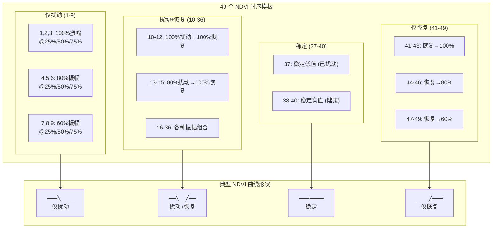

---

## 8. 系统部署架构图

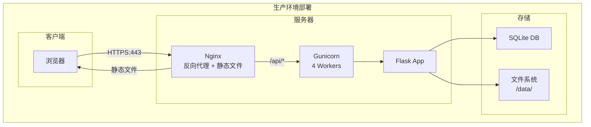

---

## 9. 数据流图 (DFD)

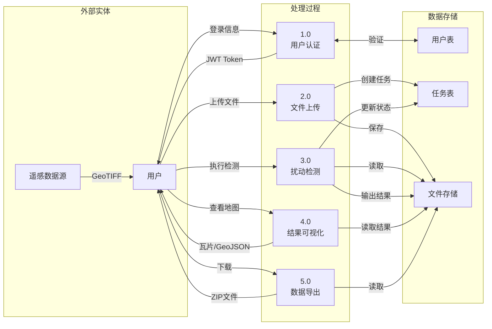

---

## 10. 状态机图 - 任务状态流转

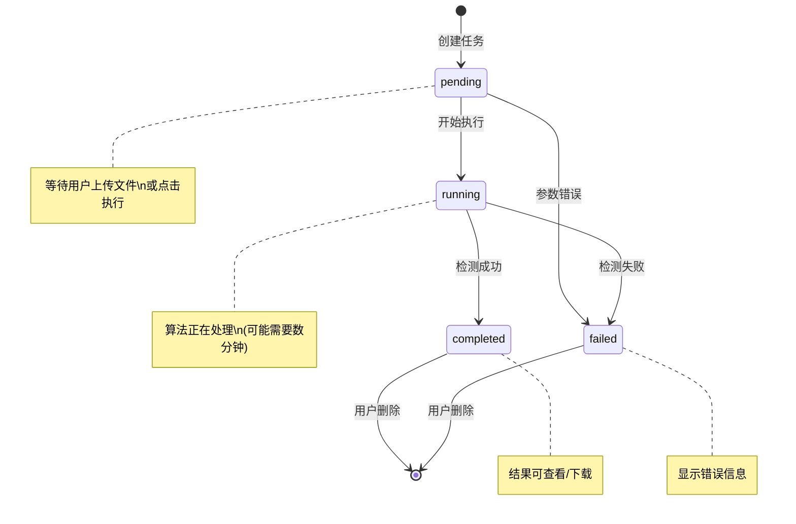

---

## 11. API 接口关系图

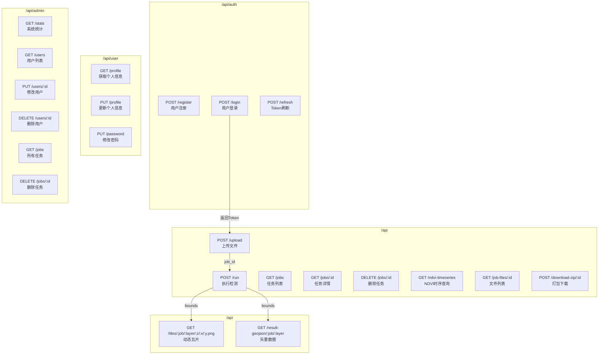

---

## 图表导出说明

### 方法1: 使用 Mermaid Live Editor
1. 访问 https://mermaid.live/
2. 复制上述 Mermaid 代码
3. 导出为 PNG/SVG

### 方法2: 使用 VS Code
1. 安装插件 "Markdown Preview Mermaid Support"
2. 打开此文件预览
3. 右键导出图片

### 方法3: 使用 Typora
1. 用 Typora 打开此 Markdown 文件
2. 文件 → 导出 → PDF 或图片

### 方法4: GitHub 渲染
1. 将此文件推送到 GitHub
2. 在 GitHub 上查看会自动渲染 Mermaid 图表

---

**文档版本**: 1.0.0
**最后更新**: 2026年2月1日
